<h1 align="center">DiagnosisXAI</h1>

<p align="center">
  <strong>Apoio ao diagnóstico preditivo de câncer de mama com Inteligência Artificial Explicável</strong><br>
  Trabalho de Conclusão de Curso · Bacharelado em Ciência da Computação<br>
  Universidade Tuiuti do Paraná · 2026
</p>

<p align="center">
  
  
  
  
</p>

<p align="center">
  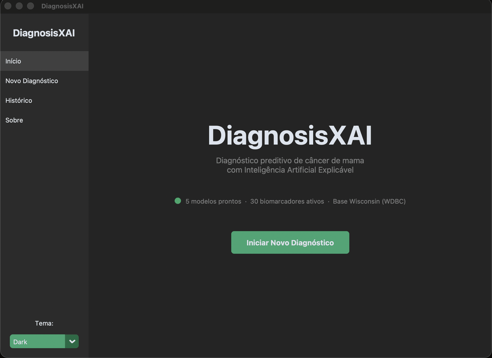
</p>

Um software de apoio à decisão clínica que classifica lotes de pacientes a partir dos
30 biomarcadores morfológicos da base *Breast Cancer Wisconsin (WDBC)*, e que, mais do
que prever, **explica cada decisão e avisa quando não se deve confiar nela**.

O sistema combina cinco modelos de Machine Learning (mais um comitê que os agrega),
probabilidades recalibradas, uma política de abstenção que devolve casos incertos para
revisão humana, detecção de perfis fora da distribuição de treino, e uma janela de
explicabilidade própria para cada algoritmo com SHAP e UMAP como camadas
complementares.

---

## Índice

1. [Visão geral](#1-visão-geral)
2. [Instalação](#2-instalação)
3. [Como rodar](#3-como-rodar)
4. [O app em seis passos](#4-o-app-em-seis-passos)
5. [Modelos implementados](#5-modelos-implementados)
6. [Como o sistema decide: a régua](#6-como-o-sistema-decide-a-régua)
7. [Confiabilidade da predição](#7-confiabilidade-da-predição)
8. [Explicabilidade por modelo](#8-explicabilidade-por-modelo)
9. [Auditoria acadêmica](#9-auditoria-acadêmica)
10. [Histórico de sessões](#10-histórico-de-sessões)
11. [Memorial de cálculo e glossário](#11-memorial-de-cálculo-e-glossário)
12. [Rigor estatístico (notebook)](#12-rigor-estatístico-notebook)
13. [Testes automatizados](#13-testes-automatizados)
14. [Estrutura do repositório](#14-estrutura-do-repositório)
15. [Base de dados](#15-base-de-dados)
16. [Cronograma](#16-cronograma)
17. [Referências](#17-referências)

---

## 1. Visão geral

### O problema

Um classificador que devolve apenas "Maligno" ou "Benigno", não diz o quanto está seguro, não diz por quê, e não avisa quando o
paciente à sua frente não se parece com nada que ele viu no treino. O erro que importa,
liberar como benigno um tumor maligno, não tem volta, e acontece em silêncio.

### O que o software faz

O DiagnosisXAI ataca isso em quatro frentes, todas visíveis na interface:

| Frente | O que entrega |
|---|---|
| **Predição** | 5 modelos + 1 comitê, sobre lotes de pacientes importados por CSV |
| **Calibração** | a certeza exibida corresponde à frequência real (escalonamento de Platt) |
| **Abstenção** | casos na faixa incerta são devolvidos como `Revisar`, em vez de chutados |
| **Explicação** | uma janela de explicabilidade por algoritmo, adaptada à natureza de cada um |

<p align="center">
  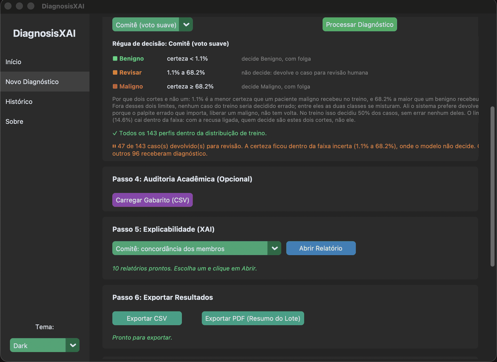
  <br><em>A régua de decisão do comitê, com os dois cortes calibrados e os avisos do lote.</em>
</p>

---

## 2. Instalação

### Pré-requisitos

- **Python 3.11 ou 3.12**
- **Git**

```bash
python3 --version   # deve retornar 3.11.x ou 3.12.x
git --version
```

### Instalando o Python

<table>
<tr><th>macOS</th><th>Windows</th><th>Linux (Ubuntu/Debian)</th></tr>
<tr valign="top">
<td>

```bash
brew install python@3.12
brew install python-tk@3.12
```

</td>
<td>

Baixe em [python.org](https://www.python.org/downloads/)
e marque **"Add Python to PATH"**.

</td>
<td>

```bash
sudo apt update
sudo apt install python3.12 \
  python3.12-venv python3-pip \
  python3-tk
```

</td>
</tr>
</table>

> **A interface é Tkinter, e ele vem separado do Python em vários sistemas.**
> No macOS via Homebrew e no Linux, instalar só o Python **não basta**: o app falha com
> `ModuleNotFoundError: No module named '_tkinter'`. Os comandos acima já incluem o
> pacote do Tk. No Windows, o instalador oficial já traz o Tkinter embutido.
>
> Para conferir antes de seguir: `python3 -c "import tkinter; print(tkinter.TkVersion)"`

### Passo a passo

```bash
# 1. Clonar
git clone https://github.com/Gabas/DiagnosisXAI.git
cd DiagnosisXAI

# 2. Ambiente virtual
python3 -m venv .venv
source .venv/bin/activate          # Windows: .venv\Scripts\activate

# 3. Dependências
pip install --upgrade pip
pip install -r requirements.txt
```

O prompt mostra `(.venv)` quando o ambiente está ativo. A instalação leva alguns minutos
na primeira vez, `shap` e `umap-learn` podem compilar extensões nativas.


---

## 3. Como rodar

### O aplicativo

O `data/wisconsin.pkl` já vem versionado no repositório, só precisa ser regerado se
você retreinar os modelos pelo notebook.

```bash
source .venv/bin/activate
cd app
python main.py
```

| Aba | Função |
|---|---|
| **Início** | Tela inicial com o status do sistema (modelos carregados, biomarcadores ativos) |
| **Novo Diagnóstico** | O pipeline completo, em seis passos |
| **Histórico** | Sessões anteriores, com os relatórios de explicabilidade preservados |
| **Sobre** | Ficha do projeto, memorial de cálculo e glossário dos 30 biomarcadores |

O tema (Dark / Light / System) troca pelo seletor no rodapé da barra lateral.

> **A interface se adapta à tela.** O layout foi desenhado para um monitor de 1920×1080;
> em telas menores, [`app/utils/ui.py`](app/utils/ui.py) reduz a escala global dos
> widgets, limita cada janela a 90% da área disponível e encolhe figuras, listas e
> tabelas proporcionalmente, em vez de abrir janelas maiores que a tela e empurrar
> conteúdo para fora do campo visível.

### O notebook

Cobre todo o pipeline científico: EDA, treinamento, avaliação, rigor estatístico, UMAP,
SHAP e a exportação dos modelos.

```bash
source .venv/bin/activate
jupyter lab                        # abre em http://localhost:8888
```

Abra `notebooks/Wisconsin.ipynb` e execute com **Run > Run All Cells**.

> O `data/wisconsin.pkl` é (re)gerado na **Seção 14 - Exportação dos Modelos**, ao final
> do notebook. Interromper antes disso deixa o artefato desatualizado em relação ao que
> foi treinado.

### Os testes

```bash
source .venv/bin/activate
pytest
```

---

## 4. O app em seis passos

A aba **Novo Diagnóstico** conduz o lote da importação à exportação:

| Passo | O que faz |
|---|---|
| **1 · Importar Dados Brutos (CSV)** | Carrega o lote e mostra os valores crus na tabela |
| **2 · Higienizar e Escalar (Z-Score)** | Limpa e padroniza com o `StandardScaler` do treino |
| **3 · Inteligência Artificial** | Escolha do modelo, régua de decisão e inferência |
| **4 · Auditoria Acadêmica** *(opcional)* | Confronta o lote com um gabarito e mede o desempenho |
| **5 · Explicabilidade (XAI)** | Abre a janela de explicação do modelo escolhido |
| **6 · Exportar Resultados** | CSV completo e PDF de resumo do lote |

### Formato do CSV de entrada

As 30 colunas morfológicas da base Wisconsin, sem `id` e sem `diagnosis`. A padronização
Z-score é aplicada no Passo 2 com os parâmetros aprendidos no treino, o arquivo de
entrada deve conter valores brutos.

Os arquivos de exemplo já estão em `data/`:

| Arquivo | Uso |
|---|---|
| `dataTeste_sem_diagnostico.csv` | Entrada do Passo 1 |
| `dataTeste_com_diagnostico.csv` | Gabarito do Passo 4 |

### O resultado

Além do diagnóstico, cada linha traz as colunas que dizem **o quanto confiar nele**:

<p align="center">
  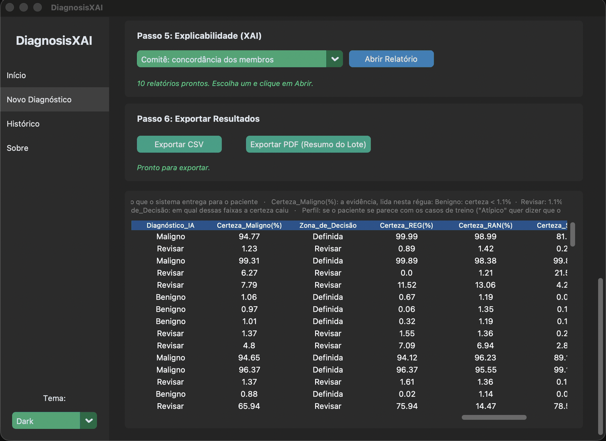
</p>

| Coluna | Pergunta que responde | Conteúdo |
|---|---|---|
| `Diagnóstico_IA` | *O quê?* | `Maligno`, `Benigno` ou `Revisar` (abstenção) |
| `Certeza_Maligno(%)` | *Com quanta evidência?* | Probabilidade **calibrada** de malignidade |
| `Zona_de_Decisão` | *Quão firme?* | `Definida`, `Limítrofe` ou `Revisar` |
| `Perfil` | *A evidência vale?* | `Típico` ou `Atípico` (fora da distribuição de treino) |

No modo **Todos (Comparação)**, a tabela troca essas colunas por uma coluna `IA_XXX` por
modelo, mostrando o que cada um entregaria para o mesmo paciente, cada um julgado pelo
seu próprio limiar.

---

## 5. Modelos implementados

Cinco algoritmos individuais e um comitê que os agrega. Os hiperparâmetros abaixo são os
efetivamente serializados em `data/wisconsin.pkl`.

| Modelo | Configuração |
|---|---|
| **Árvore de Decisão** | critério de entropia |
| **KNN** | 4 vizinhos, peso por distância, métrica Manhattan |
| **Regressão Logística** | `solver=liblinear`, `C=0.1`, `class_weight=balanced` |
| **Random Forest** | 500 árvores, profundidade máx. 10, entropia, `max_features=sqrt`, `min_samples_leaf=2`, `class_weight=balanced_subsample` |
| **SVM** | kernel RBF, `C=1.0`, `gamma=scale`, `class_weight=balanced` |
| **Comitê (voto suave)** | média das probabilidades calibradas de **Regressão Logística, Random Forest, SVM e KNN** |

### Sobre o comitê

O comitê não é um sexto algoritmo treinado: é a **média aritmética das probabilidades
calibradas** dos quatro membros que possuem calibração. Todos pesam igual, nenhum
membro decide sozinho. A Árvore de Decisão fica de fora por não ter versão calibrada.

A lógica é de diluição de erro: quando um membro se engana isoladamente, os outros três
puxam a média de volta. O preço é custo computacional (executa quatro modelos por lote) e
a ausência de um explicador próprio, a justificativa precisa ser montada a partir dos
relatórios dos membros, e quando eles discordam entre si não há narrativa única a
apresentar. O relatório do comitê expõe exatamente isso.

Todos os modelos são avaliados com Acurácia, Sensibilidade, Especificidade, F1, ROC-AUC e
PR-AUC.

---

## 6. Como o sistema decide: a régua

O Passo 3 mostra, por extenso, **como o modelo selecionado decide**, três faixas
contíguas que cobrem 0 a 100%, sendo a do meio exatamente o intervalo em que a decisão é
incerta.

```
Benigno          │  Revisar (devolve ao humano)  │          Maligno
certeza < 1,1%   │        1,1% a 68,2%           │   certeza ≥ 68,2%
```

### De onde vêm os cortes

Os limiares são calibrados por `scripts/calibrar_limiares.py` e gravados em
`data/limiares.json`. O critério: **o menor limiar cuja especificidade *out-of-fold*
atinge o piso de 92%**, medido em 5 dobras estratificadas sobre o treino, com calibração
de Platt reajustada dentro de cada dobra.

| Modelo | Limiar de operação | Faixa de recusa | Cobertura no treino | Sens. / Espec. |
|---|:---:|:---:|:---:|:---:|
| Regressão Logística | 15,1% | 0,3% – 67,0% | 59,9% | 97,5% / 92,1% |
| Random Forest | 12,1% | 1,3% – 92,2% | 55,2% | 96,9% / 92,1% |
| SVM | 15,5% | 0,4% – 73,0% | 64,8% | 97,5% / 92,1% |
| KNN | 17,0% | — | 100,0% | 96,2% / 92,1% |
| **Comitê (voto suave)** | **14,6%** | **1,1% – 68,2%** | **49,8%** | **98,1% / 92,1%** |
| Árvore de Decisão | — | — | 100,0% | — |

Os extremos da faixa de recusa têm significado literal: o limite inferior é **a menor
certeza que um paciente maligno recebeu no treino**, e o superior **a maior que um
benigno recebeu** (probabilidades *out-of-fold*). Fora desses dois limites, nenhum caso do
treino seria decidido errado; entre eles, as duas classes se misturam.

### Os dois modos de operação

- **Adiar casos incertos (Ligado por padrão):** a faixa do meio é a de recusa. O sistema
  devolve o caso como `Revisar` em vez de decidir.
- **Desligado:** a faixa passa a ser o limiar de operação ±10 pontos; ali o sistema
  decide, mas marca o caso como `Limítrofe`.

**Por que a recusa é o padrão?** O erro que este sistema existe para evitar é o falso
negativo. Chamar de benigno um tumor maligno manda o paciente para casa sem qualquer
sinal de alerta, e o custo aparece meses depois. Diante de uma probabilidade que não
separa as classes, arriscar um palpite não é neutro, é escolher esse risco. Quem opera
pode desligar a recusa e receber um rótulo para todos os casos, mas isso passa a ser uma
decisão consciente. **KNN e Árvore de Decisão não oferecem a opção** e decidem todos os
casos: o primeiro não tem faixa de recusa calibrada, e o segundo não tem probabilidade
calibrada.

O painel também exibe o motivo do corte (critério, dados usados e desempenho medido), e a
régua acompanha o lote nos PDFs exportados, sem ela, uma linha "Maligno, certeza 25%"
não seria conferível fora do app.

---

## 7. Confiabilidade da predição

Três sinais independentes, que respondem a perguntas diferentes:

### 1. Calibração — *a certeza exibida significa o que diz?*

As probabilidades passam por **escalonamento de Platt** (Seção 14.1 do notebook) e são
validadas por escore de Brier e ECE. Sem isso, "90%" pode não corresponder a 90% de
frequência real de malignidade.

### 2. Perfil atípico (*out-of-distribution*) — *a evidência vale para este paciente?*

Distância de **Mahalanobis** ao centro do treino, com covariância regularizada de
**Ledoit-Wolf**, no espaço completo dos 30 atributos padronizados. Acima do **percentil
99** das distâncias do treino, o perfil é marcado como `Atípico`: o modelo está
extrapolando para uma região pouco vista.

> A projeção UMAP 2D **não** é usada aqui. Reduzir a 2D descartaria justamente a
> informação necessária para julgar atipicidade.

### 3. Zona de decisão — *quão firme é esta decisão?*

Como a certeza é calibrada, a distância até o corte reflete incerteza real: dentro da
faixa do meio, um pequeno deslocamento inverteria o diagnóstico. Esses casos são
devolvidos (`Revisar`) ou, com a recusa desligada, sinalizados (`Limítrofe`).

Em conjunto, os três permitem ao sistema não apenas prever, mas **avisar quando a
previsão é menos confiável**, seja porque a decisão em si é incerta, seja porque o
paciente é atípico em relação ao que o modelo aprendeu.

---

## 8. Explicabilidade por modelo

No Passo 5, cada modelo abre uma janela própria, com ranking global de biomarcadores,
gráfico e detalhamento por paciente. Cada tela é adaptada à natureza do algoritmo, em vez
de aplicar a mesma visualização genérica a todos. As **seis janelas por modelo** exportam
o laudo do paciente selecionado em PDF; SHAP e UMAP são telas de leitura.

<table>
<tr>
<td width="50%" valign="top">

**Comitê — concordância dos membros**

Em que fração do lote cada membro, sozinho e pelo próprio limiar, chegaria ao mesmo lado
que a média. Por paciente: a posição de cada membro e o motivo da devolução (consenso,
discordância, fronteira ou cautela da política).

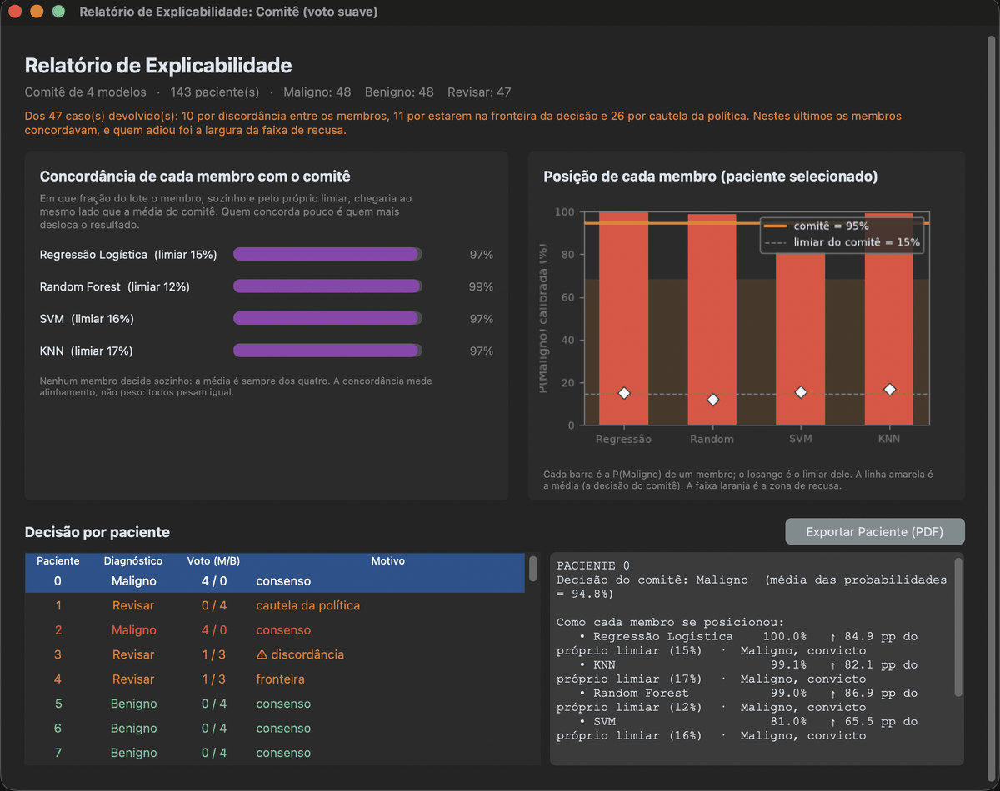

</td>
<td width="50%" valign="top">

**SVM — vetores de suporte e margem**

Mapa populacional com os vetores de suporte em destaque e o balanço de forças por
paciente. A margem, a "rua" entre `z = −1` e `z = +1` que o SVM maximiza, tem versão
interativa no navegador.

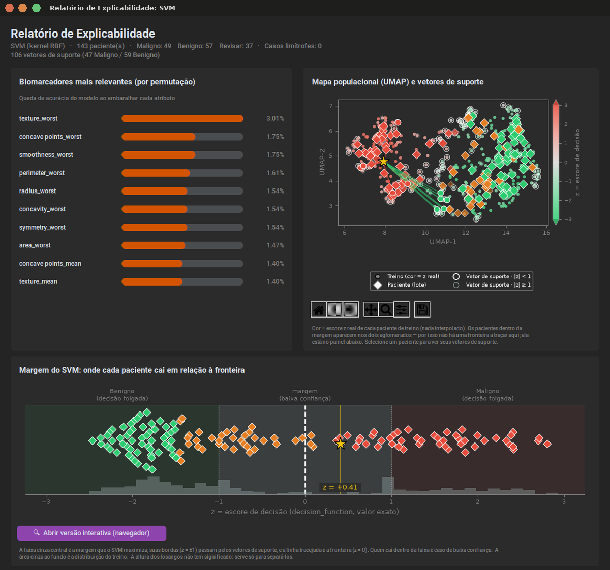

</td>
</tr>
<tr>
<td width="50%" valign="top">

**Regressão Logística — curva logística**

Cada paciente posicionado em (escore `z = w·x + b`, `P(Maligno) = σ(z)`). Ao selecionar
um paciente, exibe a função matemática da decisão: o valor de `z`, a aplicação da
sigmoide e a regra `z ≷ 0`.

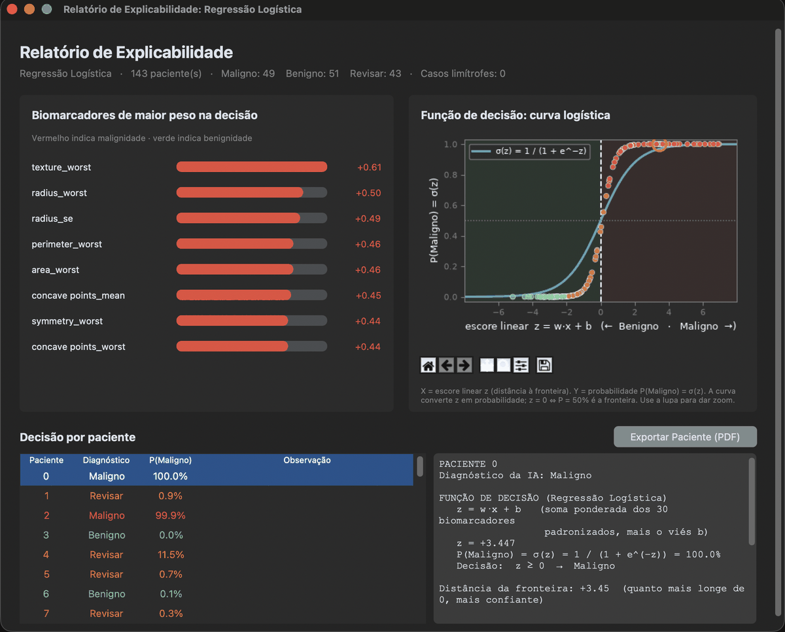

</td>
<td width="50%" valign="top">

**KNN — mapa de vizinhança**

Projeção PCA 2D destacando os *K* vizinhos que efetivamente votaram, com a distância de
cada um e o peso que teve no voto. Zoom e pan disponíveis.

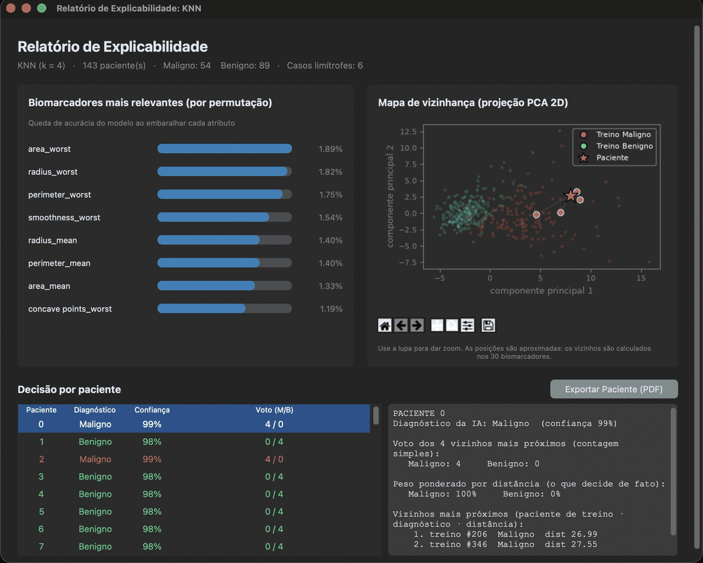

</td>
</tr>
<tr>
<td width="50%" valign="top">

**Random Forest — consenso das árvores**

Importância por **Gini** (redução de impureza agregada pela floresta) e a distribuição
da votação das 500 árvores para o paciente selecionado.

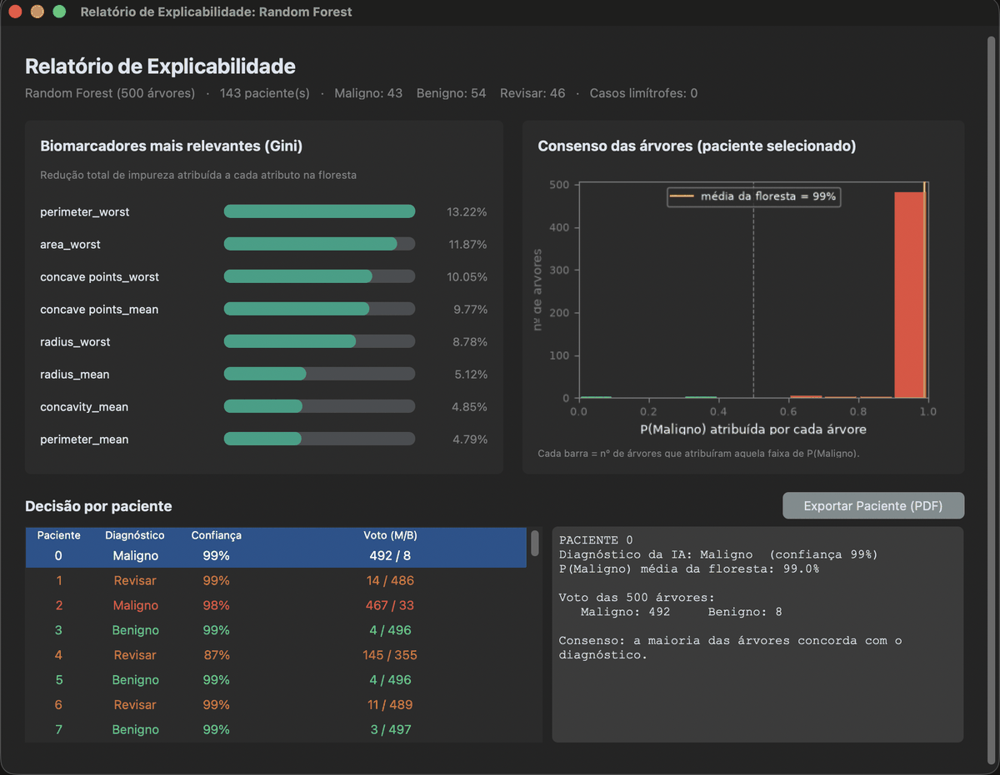

</td>
<td width="50%" valign="top">

**Árvore de Decisão — ganho de informação**

Redução de entropia (`Δentropia`) por biomarcador e, por paciente, o caminho de regras
percorrido da raiz até a folha.

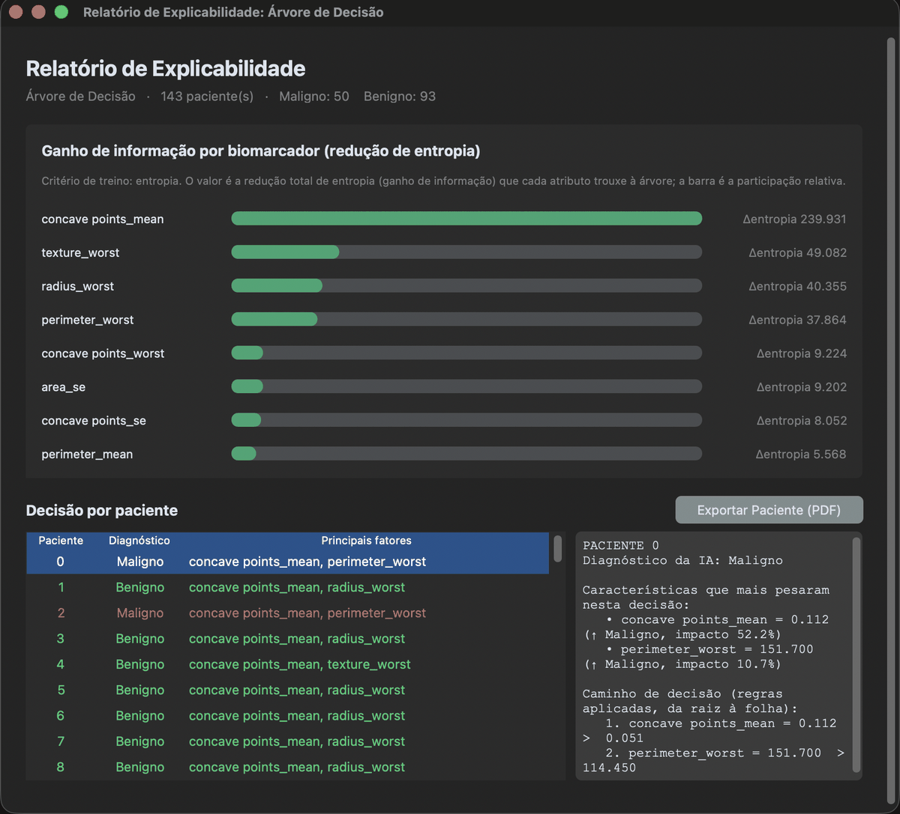

</td>
</tr>
</table>

### Camadas complementares

<table>
<tr>
<td width="50%" valign="top">

**SHAP — contribuição por biomarcador**

Atribui a cada atributo sua contribuição para a decisão daquele paciente, com
importância global e o desdobramento individual. Disponível para os cinco modelos.

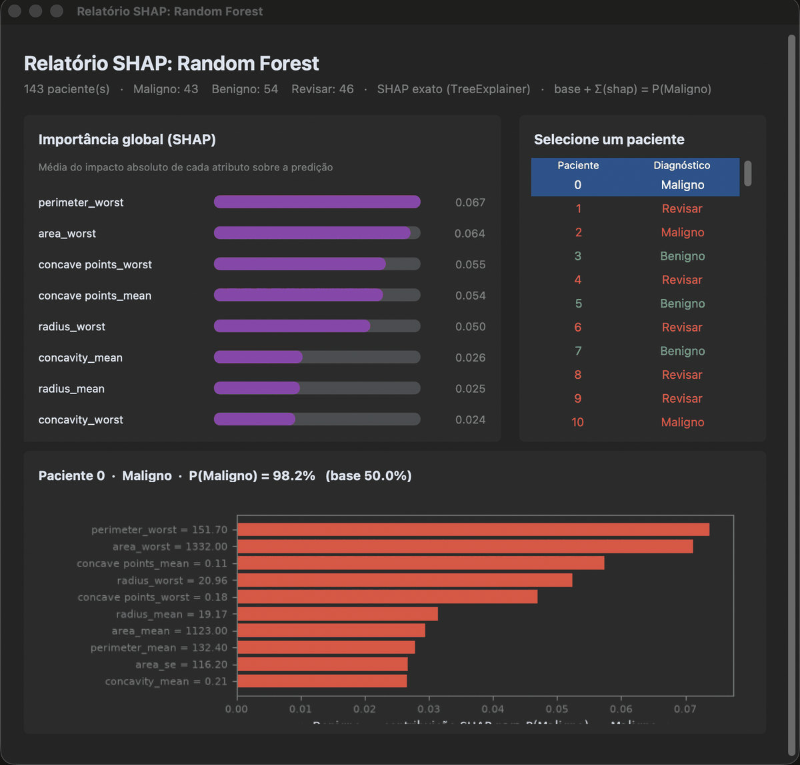

</td>
<td width="50%" valign="top">

**UMAP — mapa populacional**

Projeta o lote sobre o embedding do treino, mostrando onde cada paciente cai em relação
à população conhecida. Versão interativa em Bokeh, aberta no navegador.

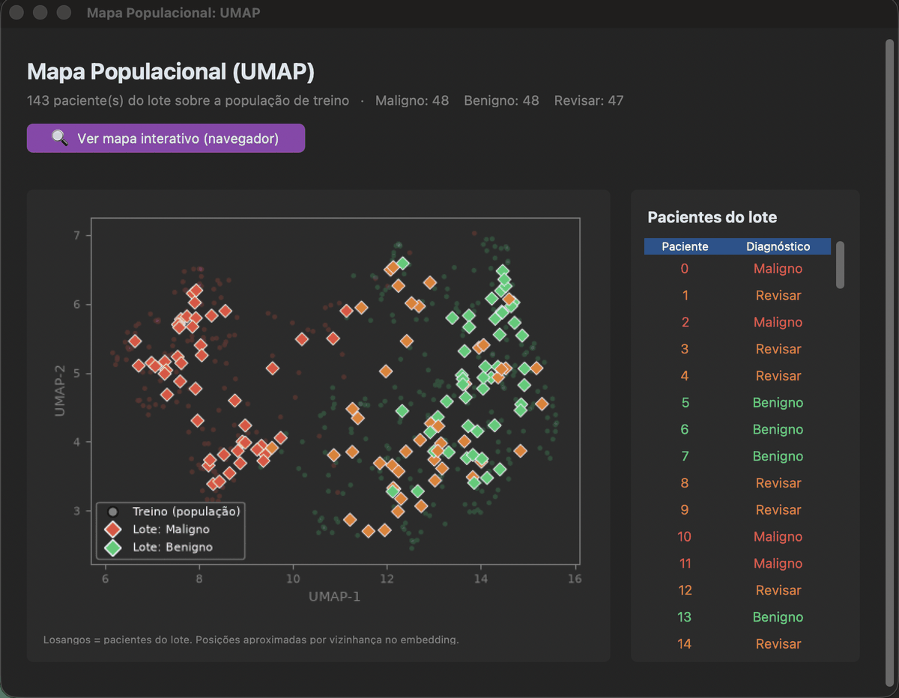

</td>
</tr>
</table>

As telas da **Regressão Logística, do KNN e do SVM** trazem barra de zoom e pan sobre o
gráfico embutido. O **mapa populacional** e a **margem do SVM** oferecem ainda versões
interativas em **Bokeh** (hover com os dados do paciente, zoom, legenda clicável) abertas
no navegador.

---

## 9. Auditoria acadêmica

O Passo 4 confronta o lote com um gabarito e mede o desempenho de cada modelo, não só
com números, mas com uma **leitura crítica** gerada automaticamente: pontos fortes,
ressalvas e um veredito de uso.

<p align="center">
  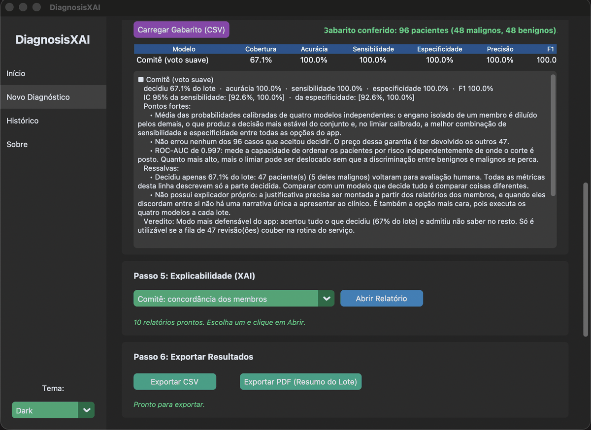
</p>

A tabela traz cobertura, acurácia, sensibilidade, especificidade, precisão, F1 e a matriz
de confusão, a matriz fica à direita porque é a origem de todas as
métricas, e é ela que permite conferir os percentuais em lotes pequenos. As proporções
vêm acompanhadas do **intervalo de confiança de Wilson (95%)**.

> **Cobertura muda o significado de todas as outras métricas.** Um modelo que se abstém
> decide apenas parte do lote, e suas métricas descrevem só essa parte. Comparar a
> acurácia de um modelo que decidiu 50% do lote com a de outro que decidiu 100% é
> comparar coisas diferentes, por isso a cobertura é a primeira coluna da tabela, e a
> leitura crítica repete a ressalva por extenso.

No modo **Todos (Comparação)**, a auditoria avalia os seis modelos lado a lado:

<p align="center">
  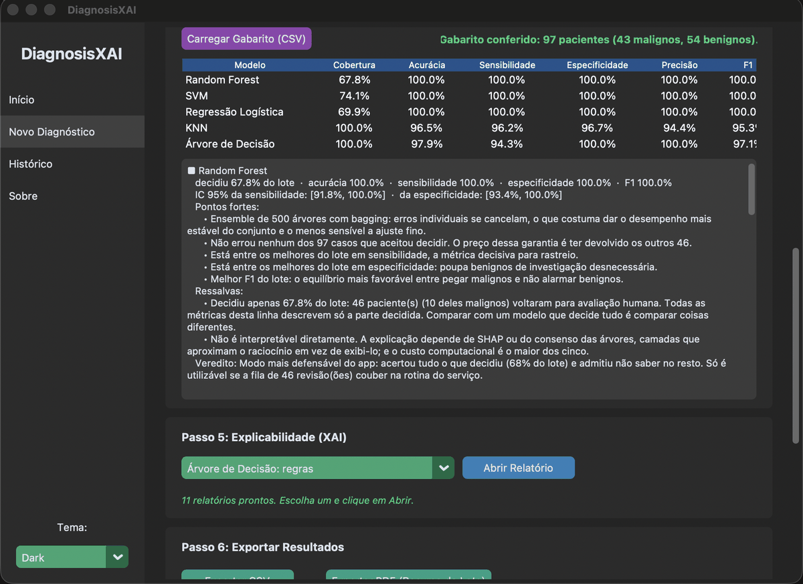
</p>

---

## 10. Histórico de sessões

Cada execução do Passo 3 é persistida em `data/history.json`: arquivo de origem, modelo,
composição do lote (malignos, benignos, adiados) e a acurácia quando houve auditoria.

<p align="center">
  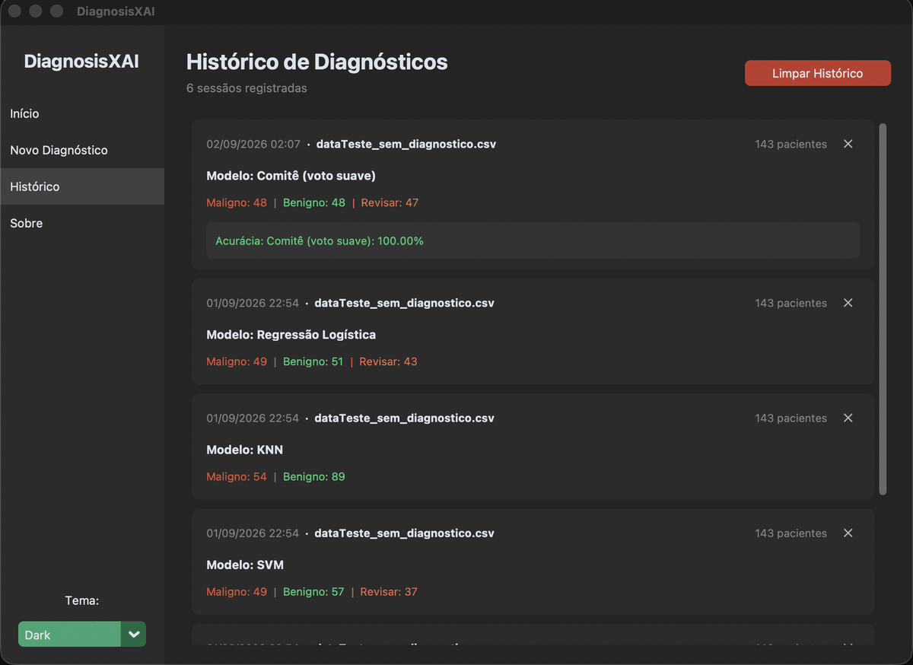
</p>

O histórico guarda também os **relatórios de explicabilidade embutidos**, uma sessão
antiga pode ser reaberta com suas explicações intactas, sem reprocessar o lote.

---

## 11. Memorial de cálculo e glossário

A aba **Sobre** responde à pergunta que a interface mais provoca: *de onde vem cada
número que o sistema exibe?*

<p align="center">
  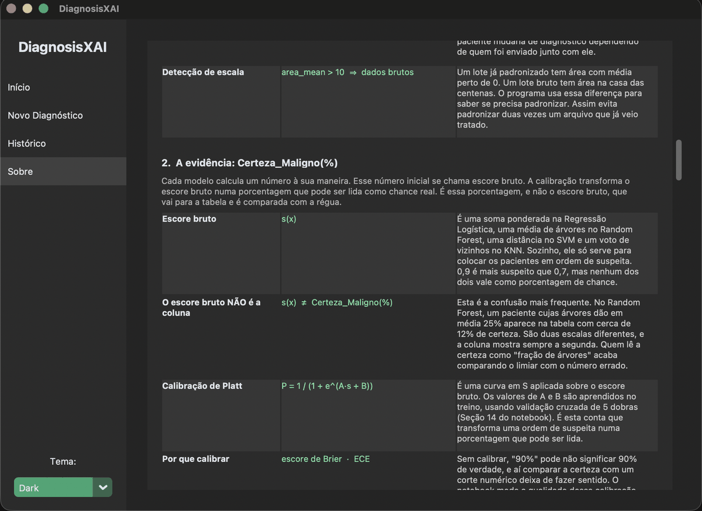
</p>

| | O que é | Natureza |
|---|---|---|
| `Certeza_Maligno(%)` | probabilidade calibrada daquele paciente | medida **no paciente**, muda linha a linha |
| Os cortes da régua | onde o modelo decide cortar | escolhidos **no treino**, fixos para todo o lote |

Confundi-las leva a comparar uma certeza de 18% com 50% e concluir "Benigno" onde o
sistema decidiu "Maligno". Em seguida o card percorre, na ordem dos Passos 1 a 5:
padronização Z-score, calibração de Platt, a régua (limiar, faixa de recusa e banda, e
quais são medidos e qual é convenção), a distância de Mahalanobis, as métricas da
auditoria com o intervalo de Wilson, e a matemática de cada explicador.

O conteúdo é **fonte única** em [`app/core/calculos.py`](app/core/calculos.py), com testes
que comparam os números citados no texto com os que o código realmente usa.

### Glossário de biomarcadores

A mesma aba traz um glossário dos 30 atributos: o que cada biomarcador mede, o
significado das três estatísticas (`_mean` / `_se` / `_worst`) e, um ponto de honestidade
científica, que a maioria **não tem unidade física** (são índices adimensionais ou
medidas na escala de pixel da imagem, não em milímetros), além de serem padronizados por
Z-score antes da predição. As mesmas descrições aparecem como *tooltip* ao passar o mouse
sobre os cabeçalhos da tabela de resultados.

---

## 12. Rigor estatístico (notebook)

Além do desempenho num único conjunto de teste, a **Seção 10** do notebook submete os
modelos a quatro análises complementares:

| Subseção | O que responde | Método |
|---|---|---|
| **10.1** Validação cruzada | Quão *estável* é o desempenho entre partições? | k-fold estratificado repetido (10 × 5), com padronização reajustada dentro de cada dobra (sem vazamento); média ± desvio-padrão |
| **10.2** Significância | As diferenças *entre modelos* são reais ou ruído? | Teste pareado 5×2cv (Dietterich) + Friedman com pós-hoc de Nemenyi (α = 0,05) |
| **10.3** Calibração | A *probabilidade* prevista corresponde à frequência real? | Diagrama de confiabilidade, escore de Brier e ECE |
| **10.4** Perfis atípicos | O paciente está dentro do que o modelo viu? | Mahalanobis com Ledoit-Wolf, corte no percentil 99 |

As probabilidades **recalibradas** na Seção 14.1 são as que alimentam a coluna
`Certeza_Maligno(%)` do app.

<details>
<summary><strong>Todas as seções do notebook</strong></summary>

<br>

| Seção | Conteúdo |
|---|---|
| 1 | Configuração inicial |
| 2 | Funções auxiliares para gráficos e métricas (ROC/PR, matriz de confusão) |
| 3 | Carregamento e preparação da base |
| 4 | Análise Exploratória (EDA) — estatísticas, distribuição das classes, histogramas, boxplots |
| 5 | Árvore de Decisão — *baseline* |
| 6 | K-Nearest Neighbors (KNN) |
| 7 | Regressão Logística |
| 8 | Random Forest |
| 9 | SVM (Support Vector Machine) |
| 10 | **Rigor estatístico** — validação cruzada, significância, calibração, OOD |
| 11 | Visualização de estrutura: UMAP e PCA |
| 12 | Interpretabilidade com SHAP (todos os modelos) |
| 13 | Explicabilidade interpretável (Árvore e Regressão Logística) |
| 14 | **Exportação dos modelos** — gera o `data/wisconsin.pkl` (14.1: recalibração) |

</details>

---

## 13. Testes automatizados

```bash
pytest
```

**183 testes** cobrindo `app/core/` e os utilitários. A interface gráfica não é testada.
Dois grupos:

- **Isolados** (`test_explainers.py`, `test_history_manager.py`, `test_pdf_report.py`,
  `test_calculos.py`, `test_decision.py`, `test_metrics.py`, `test_committee.py`,
  `test_ood_detector.py`, `test_biomarkers.py`, `test_ui.py`, `test_bokeh_map.py`), não
  dependem do `wisconsin.pkl` nem do `history.json` reais. Os explicadores são testados
  sobre modelos treinados na hora com a base pública do scikit-learn
  (`load_breast_cancer`); o foco é validar que **a decisão exibida sempre bate com a
  decisão real do modelo** (`predict` / `predict_proba` / `decision_function`), o tipo de
  inconsistência já encontrado e corrigido no SVM e no KNN durante o desenvolvimento.

- **De integração**, **44 dos 183 testes** exercitam o `data/wisconsin.pkl` versionado
  (36 em `test_predictor.py`, 4 em `test_batch_processor.py` e 4 em `test_calculos.py`).
  Servem também como *smoke test* do artefato: se o notebook for reexecutado e gerar um
  `.pkl` com formato diferente, esses testes acusam.

---

## 14. Estrutura do repositório

```text
DiagnosisXAI/
├── app/
│   ├── core/                        # Lógica de domínio (sem dependência de UI)
│   │   ├── batch_processor.py       # Limpeza e padronização Z-score do lote
│   │   ├── biomarkers.py            # Glossário dos 30 atributos (descrições + tooltips)
│   │   ├── calculos.py              # Memorial de cálculo — fonte única dos números do app
│   │   ├── committee.py             # Comitê de voto suave e sua explicação
│   │   ├── decision.py              # Régua: limiar, faixa de recusa, banda e zonas
│   │   ├── explainers.py            # Explicadores exatos, um por algoritmo
│   │   ├── history_manager.py       # Persistência das sessões em data/history.json
│   │   ├── inference.py             # Carregamento do wisconsin.pkl
│   │   ├── metrics.py               # Auditoria: métricas, IC de Wilson, leitura crítica
│   │   ├── ood_detector.py          # Perfil atípico (Mahalanobis + Ledoit-Wolf)
│   │   ├── predictor.py             # Motor de inferência e colunas de confiabilidade
│   │   └── shap_explainer.py        # Integração com SHAP
│   ├── utils/
│   │   ├── bokeh_map.py             # Mapas interativos abertos no navegador
│   │   ├── pdf_report.py            # Relatórios em PDF (lote e por paciente)
│   │   └── ui.py                    # Widgets compartilhados e geometria responsiva
│   ├── views/
│   │   ├── main_window.py           # Janela principal e navegação
│   │   ├── dashboard_view.py        # Aba Início
│   │   ├── predict_view.py          # Aba Novo Diagnóstico (os seis passos)
│   │   ├── history_view.py          # Aba Histórico
│   │   ├── about_view.py            # Aba Sobre (memorial de cálculo + glossário)
│   │   ├── info_window.py           # Janelas de detalhamento
│   │   ├── report_common.py         # Base compartilhada das janelas de relatório
│   │   ├── report_launchers.py      # Construtores de SHAP e UMAP (app e histórico)
│   │   ├── report_window.py         # Árvore de Decisão
│   │   ├── report_window_comite.py  # Comitê
│   │   ├── report_window_knn.py     # KNN
│   │   ├── report_window_lr.py      # Regressão Logística
│   │   ├── report_window_rf.py      # Random Forest
│   │   ├── report_window_shap.py    # SHAP
│   │   ├── report_window_svm.py     # SVM
│   │   └── report_window_umap.py    # Mapa populacional
│   └── main.py                      # Ponto de entrada
│
├── data/
│   ├── wisconsin.pkl                # Modelos, calibradores, scaler, explicadores SHAP
│   ├── limiares.json                # Limiares e faixas de recusa calibrados
│   ├── umap_train_2d.npy            # Embedding UMAP do treino (mapa populacional)
│   ├── history.json                 # Sessões salvas (gerado em tempo de execução)
│   ├── data.csv                     # Base WDBC completa
│   ├── dataTreinamento_*.csv        # Partição de treino (com e sem diagnóstico)
│   └── dataTeste_*.csv              # Partição de teste (com e sem diagnóstico)
│
├── notebooks/
│   └── Wisconsin.ipynb              # Pipeline científico completo (14 seções)
│
├── scripts/
│   └── calibrar_limiares.py         # Gera data/limiares.json (out-of-fold, piso de especificidade)
│
├── tests/                           # 183 testes (pytest) sobre app/core e utils
├── reports/                         # Saída dos PDFs/CSVs exportados pelo app
├── docs/img/                        # Capturas de tela usadas neste README
├── requirements.txt
└── pytest.ini
```

<details>
<summary><strong>O que há dentro de <code>wisconsin.pkl</code></strong></summary>

<br>

| Chave | Conteúdo |
|---|---|
| `model_dt`, `model_knn`, `model_lr`, `model_rf`, `model_svm` | Os cinco classificadores treinados |
| `model_knn_cal`, `model_lr_cal`, `model_rf_cal`, `model_svm_cal` | As versões calibradas (Platt), os quatro membros do comitê |
| `scaler` | `StandardScaler` ajustado no treino |
| `explainer_dt`, `explainer_knn`, `explainer_lr`, `explainer_rf`, `explainer_svm` | Explicadores serializados com `cloudpickle` |
| `shap_background`, `shap_importances` | Fundo e importâncias globais do SHAP |
| `X_train_scaled`, `X_test_scaled`, `y_train`, `y_test` | Partições padronizadas |
| `feature_names` | Nomes e ordem canônica dos 30 atributos |

O embedding UMAP do treino é lido da chave `umap_train_2d` quando presente no `.pkl`; se
ausente, o app recorre a `data/umap_train_2d.npy`.

</details>

---

## 15. Base de dados

**Breast Cancer Wisconsin Diagnostic (WDBC)**

| Atributo | Valor |
|---|---|
| Fonte | UCI Machine Learning Repository |
| Amostras | 569 pacientes |
| Classes | Benigno (357) · Maligno (212) |
| Atributos | 30 biomarcadores morfológicos de núcleos celulares |
| Extração | Punção Aspirativa por Agulha Fina (PAAF) |
| Padronização | Z-Score (μ = 0, σ = 1) |

---

## 16. Cronograma

| Etapas do Projeto | Mar | Abr | Mai | Jun | Jul | Ago | Set | Out | Nov |
|---|:---:|:---:|:---:|:---:|:---:|:---:|:---:|:---:|:---:|
| Elaboração da Proposta e Revisão Bibliográfica | ✓ | | | | | | | | |
| Ingestão, EDA, Limpeza de Dados e Visualização com UMAP | ✓ | | | | | | | | |
| Redação da Fundamentação Teórica e Metodologia | ✓ | ✓ | | | | | | | |
| Treinamento, Testes e Seleção do Modelo Preditivo | | ✓ | | | | | | | |
| Implementação e Análise de Interpretabilidade (SHAP) | | ✓ | ✓ | | | | | | |
| **Entrega e avaliação do PG I** | | | ✓ | | | | | | |
| Desenvolvimento do processamento em lote (Upload de Planilhas) | | | ✓ | | | | | | |
| Implementação da Geração de Relatórios automatizados (PDF/CSV) | | | ✓ | ✓ | | | | | |
| Validação cruzada, testes de significância e calibração | | | | ✓ | ✓ | | | | |
| Explicabilidade por modelo, comitê e sinalização de confiabilidade | | | | | ✓ | ✓ | | | |
| Testes automatizados e correção de bugs | | | | | ✓ | ✓ | | | |
| Redação do Desenvolvimento do Software, Resultados e Conclusão | | | | | | ✓ | ✓ | | |
| Validação final do sistema e ajustes | | | | | | | ✓ | ✓ | |
| Formatação ABNT e Revisão Final | | | | | | | | ✓ | ✓ |
| **Entrega e defesa do PG II** | | | | | | | | | ✓ |

---

## 17. Referências

- **Shaon et al. (2024)** — Seleção de atributos com SHAP para detecção de câncer de mama
- **Chen et al. (2023)** — Classificação com XGBoost, RF, KNN e Regressão Logística
- **Rabiei et al. (2022)** — Uso de SMOTE para balanceamento; Random Forest como melhor classificador
- **Street et al. (1993)** — Artigo fundacional da base WDBC

---

<p align="center">
  <strong>Gabriel Ast dos Santos</strong> · Orientador: Prof. Rodrigo Ramos Alves<br>
  Universidade Tuiuti do Paraná · Bacharelado em Ciência da Computação · 2026
</p>
